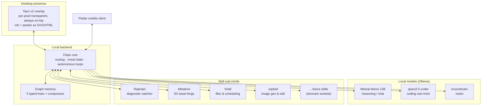

# Architecture

This is a conceptual map of how Cloe is put together — enough to understand the shape of the system and the reasoning behind it. It intentionally stops short of implementation: no real source, file layouts, or line-level detail. See [`README.md`](../README.md#why-no-source) for why.

## System overview

Metatron and Jophiel are the two heaviest sub-minds — each owns a local generation engine (a 3D diffusion pipeline and an image pipeline, respectively) that competes with the resident language model for the same 12 GB of VRAM. Both share an explicit claim/release protocol rather than trusting model residency to sort itself out; see [`METATRON.md`](METATRON.md) for why that took real iteration to get right, and [`JOPHIEL.md`](JOPHIEL.md) for what porting that same protocol to a second engine caught.

## Design principles

A few decisions run through the whole system and show up again and again in the write-ups below:

- **Everything local.** No model call, memory write, or media generation leaves the machine. This shapes almost every other decision — single-GPU model residency, on-disk memory instead of a hosted database, local generation instead of a cloud image or 3D API.
- **Skills, not god-object growth.** New capabilities (diagnostics, filesystem access, 3D pipeline work, image generation) are built as independent services with their own process, port, and orb panel — not new branches bolted onto the core chat handler. Each skill has a locked scope decided up front, which keeps the core loop from accumulating special cases.
- **Honesty over polish.** Dormant capability shows as an honestly empty state in the UI rather than a faked one — an unbuilt skill socket looks unbuilt, not "coming soon" theater. This is a standing project rule, not just a UI choice: it also governs what the memory system is allowed to claim it knows (see [`MEMORY_SYSTEM.md`](MEMORY_SYSTEM.md)).
- **Recon before building.** Nontrivial features start with a design brief that reads the current real state of the system before proposing changes — the [Vretil write-up](VRETIL.md) walks through an example of this end to end, including a UI palette pulled from the actual running app's color values rather than picked freehand.
- **Diagnose before fixing.** The system has been through structured, evidence-based audits of its own runtime behavior — every finding backed by reproduction or direct code inspection, never a guess presented as fact — which is where several of the hardening decisions described in these docs (atomic writes, sandboxed execution, lock discipline) came from.
- **Identify processes by what they are, not by a fragile relationship.** The stack's own restart path is self-managing: a dedicated step stops the previous run before the new one starts. An early version of that step trusted the operating system's reported parent-child relationship between processes to know what was safe to stop, and once, that relationship didn't hold at the exact moment it mattered — the restart step ended up stopping the very process that was trying to run it, mid-restart, with no trace beyond "everything just went quiet." The fix that stuck didn't try to make the parent-child check more reliable; it stopped depending on it at all, and excluded the process by what it actually was instead. That's the same lesson the kill/restart tooling learned earlier and the one worth carrying forward: anything that identifies "which process is safe to touch" by an incidental relationship rather than an intrinsic property is a bug waiting for the one moment that relationship doesn't hold.

## Component roles

**Tauri overlay.** A single always-on-top window with true per-pixel transparency, so the orb and any open panel float directly over whatever else is on screen. Because the window covers the full desktop but is mostly empty space, clicks have to be routed carefully: input over "nothing" needs to fall through to the desktop below, while input over an actual UI element — the orb, a panel, a button — needs to land in the app. Getting this boundary exactly right, especially across multiple monitors with different DPI scaling, was one of the harder UI-engineering problems in the project; [`ORB_UI.md`](ORB_UI.md) covers two real bugs that came from that boundary drifting out of sync with what was actually on screen.

**Flask core.** The single hub that the overlay and the mobile client both talk to. It owns request routing to the right model, current mood state, and the autonomous background loops (self-directed research, internal thought). It treats the graph memory and each skill sub-mind as services it coordinates rather than code it contains.

**Local models.** Three models held resident simultaneously on one consumer GPU, each with a fixed role rather than one general-purpose model doing everything. Single-GPU residency means VRAM budget is a real constraint — swapping models in and out has a real latency cost, which is a recurring design pressure visible in how the coding sub-mind, Metatron, Jophiel, and skill routing are all structured.

**Graph memory.** Covered in depth in [`MEMORY_SYSTEM.md`](MEMORY_SYSTEM.md) — a typed graph rather than a flat conversation log, with its own compression, locking, and protection rules.

**Skill sub-minds.** Independent processes dispatched from the core for a specific job: Raphael watches Cloe's own logs for patterns; Metatron owns the local 3D asset forge (see [`METATRON.md`](METATRON.md)); Vretil owns the standing filesystem/scheduling relationship (see [`VRETIL.md`](VRETIL.md)); Jophiel owns local image generation and editing (see [`JOPHIEL.md`](JOPHIEL.md)). Each ships with its own panel in the orb overlay, matching the overlay's existing visual language rather than introducing a new one per skill.

**Coding sub-mind.** A dedicated pipeline for self-repair and code generation tasks, described in [`CODING_SANDBOX.md`](CODING_SANDBOX.md) — generation, adversarial testing, and scoring, run inside a sandboxed executor.
